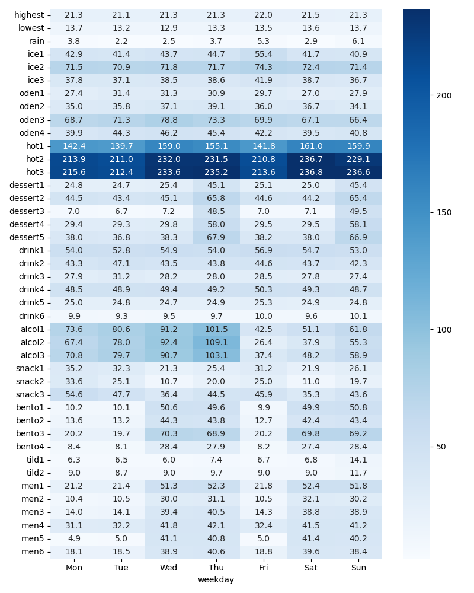
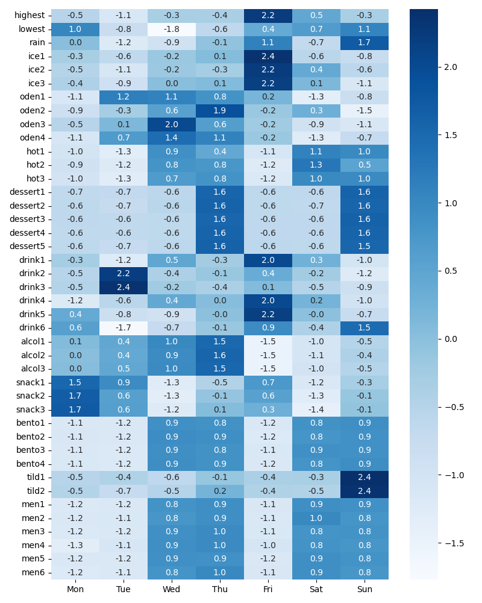
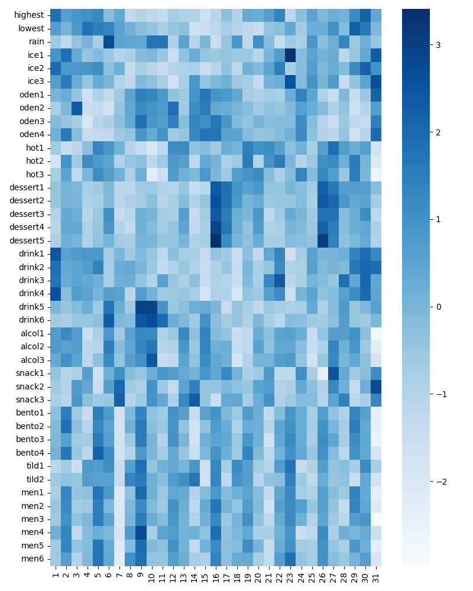
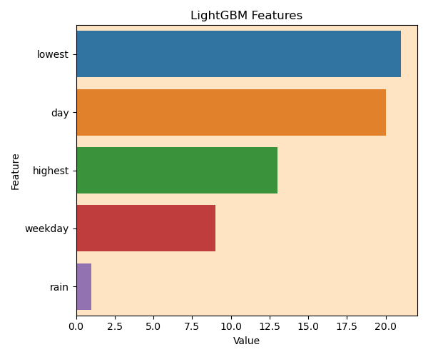

# 年推移
* アイスは夏に人気(分布には商品間で差がある)
* おでんは冬に人気
* おでん夏やってない。
* ホットスナック周期性ありそう
* デザートは週で周期性ありそう？
* ドリンクは売上の下限値がありそう
    * drink1~4は夏人気 (清涼飲料水？)
    * drink5~6は横ばい (コーヒーとか？)

# 週の周期性

週ごとに平均した値をヒートマップ化

週ごとに平均した値を標準化し、ヒートマップ化

# 日毎の周期性

日ごとに平均した値を標準化し、ヒートマップ化

# 訓練データとテストデータで似ている部分が無いか確認

* 訓練データ：0, テストデータ：1 でラベル付け。rain, highest, lowest, day, weekday を使って訓練データかテストデータか予測
    * 気温、日付は訓練データとテストデータで被っていない時があるため、重要度が高い
    * 降水量は訓練データもテストデータも同じような分布になっている
    * 曜日の重要度もそこまで高くない
    
* AUC : 0.87

